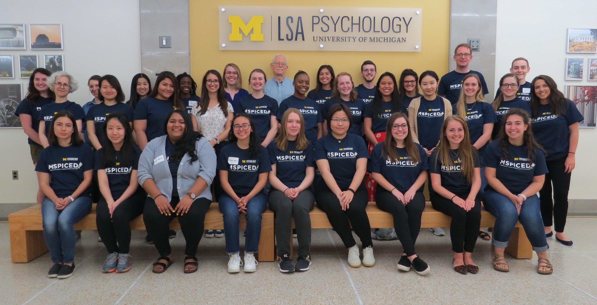

I’m currently a second year Ph.D student in Cognitive Psychology at the University of Texas. My graduate advisor is [Dr. Cristine Legare](http://cristinelegare.com/) and I work in her [EVOLearn](http://cristinelegare.com/lab) lab.

I received my B.A. in Anthropology and Psychology from Skidmore College, where my thesis work explored children’s selective trust in accented speakers and the malleability of accent-based discrimination.

    

        

            <figure>
                
                <figcaption>Spring, 2019 - Interviewing Tibetan students in Dharamsala, India</figcaption>
            </figure>
        

        

            <figure>
                
                <figcaption>Spring, 2020 - Testing pre-schoolers for my honor's thesis in Saratoga Springs, New York</figcaption>
            </figure>
        

    

    

        

            <figure>
                
                <figcaption>Spring, 2020 - I graduated Magna Cum Laude from Skidmore College with Honor in Psychology & Anthropology</figcaption>
            </figure>
        

    

During my undergraduate years I’ve worked with [Dr. Susan Gelman](https://sites.lsa.umich.edu/gelman-lab/) and [Dr. Kristan Marchack](https://languagesciences.ubc.ca/people/affiliate/kristan-marchak) to study children’s conceptual development, tendency to use overhypotheses, and ability to learn from linguistic cues of generality. 

    

        

            <figure>
                
                <figcaption>Summer, 2019 - MSPICED Cohort, University of Michigan Ann Arbor, MI</figcaption>
            </figure>
        

        

            <figure>
                
                <figcaption>Summer, 2019 - Final MSPICED poster presentation, University of Michigan Ann Arbor, MI</figcaption>
            </figure>
        

    

I am a [UWC Davis Scholar](https://www.davisuwcscholars.org/scholars/class-of-2020/k/node/14394) and I have completed my International Baccalaureate at the United World College of South East Asia, Singapore.

I was born and raised in Budapest, Hungary, but I was lucky enough to have lived in Singapore, Nepal, India and the U.S. during my academic career. The possibility to live with individuals of different cultural backgrounds has greatly influenced my research and I thrive to understand how our differences can be celebrated and how our similarities may help promote cooperation, collaboration, teaching, and learning in the current globalized environment. 

